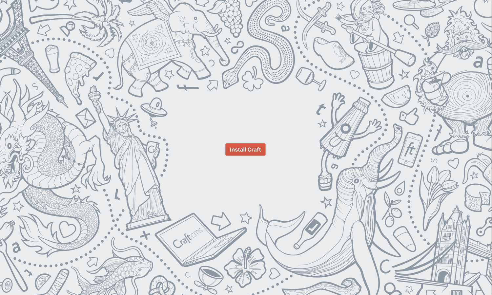
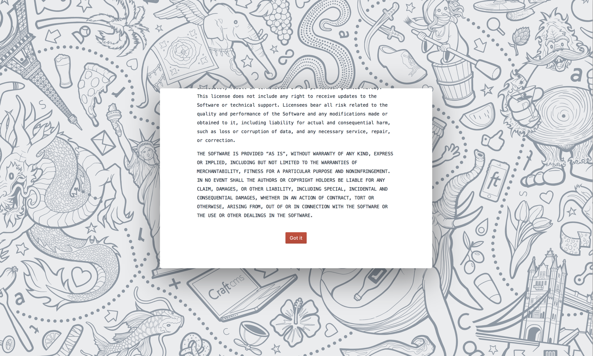
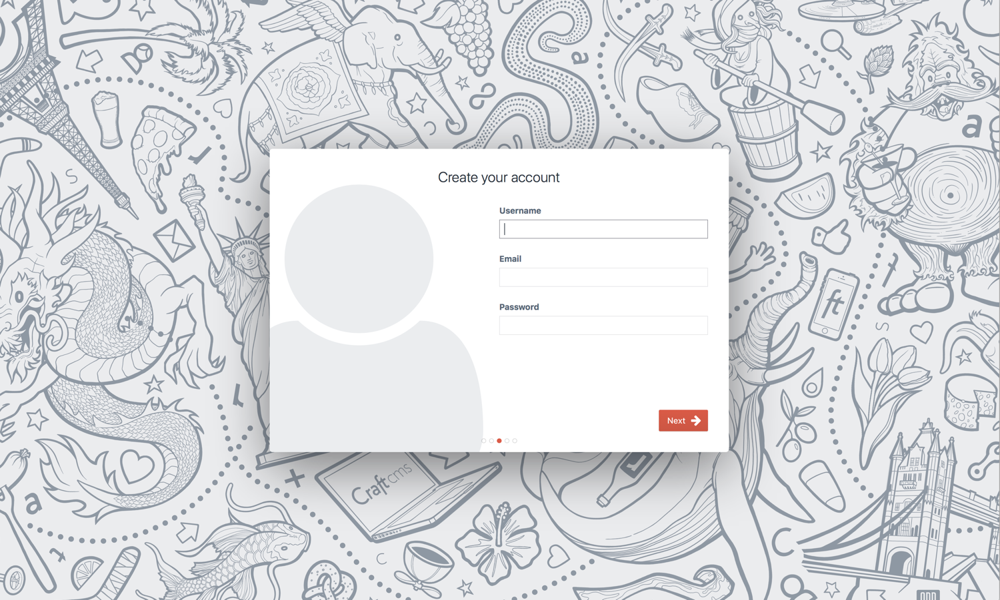
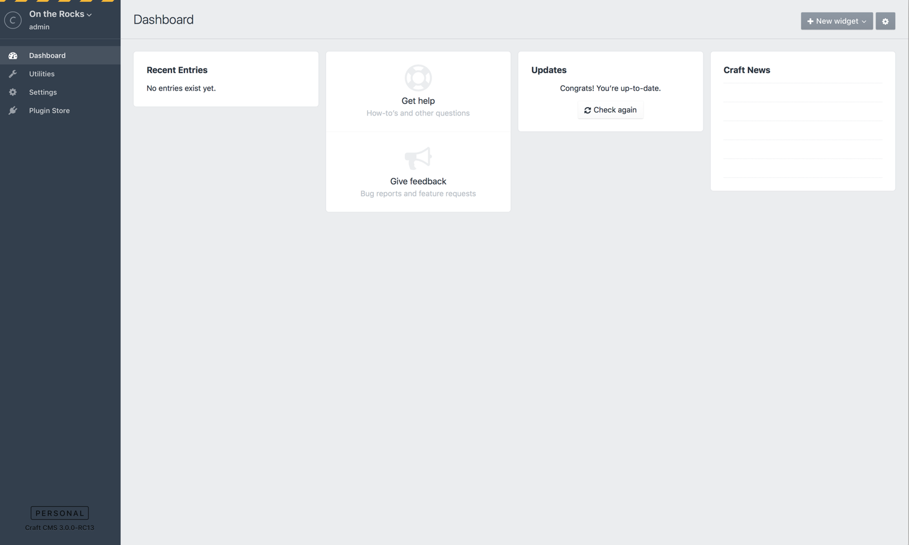

# Installation Instructions

- [0. Introduction](#0-introduction)
- [1. Install Composer](#1-install-composer)
- [2. Create a New Craft Project](#2-create-a-new-craft-project)
- [3. Set up the Database](#3-set-up-the-database)
- [4. Set up the Web Server](#4-set-up-the-web-server)

## 0. Introduction

Craft 3 is available as a [Composer] package, and for the duration of the Beta, Composer is the only way to install Craft 3. (We’ll introduce an alternate, non-Composer installation method once it’s out of Beta.) 

If you’re unfamiliar with Composer it’s a package manager for PHP that attempts to make installing and updating PHP libraries (like Craft) easy via the command line.

Craft’s Composer support has two parts:

1. **[`craftcms/cms`]** – This is the Composer package that contains all of Craft’s source code.
2. **[`craftcms/craft`]** – This is a Composer “project” that can be used as a starting point for new Craft projects.

## 1. Install Composer

You should be running Composer 1.3.0 or later. You can find out your installed version of Composer (if any) by opening your terminal running the following command:

    composer -V

If that outputs an error saying `composer` is not found or not recognized, then Composer isn’t installed. Follow Composer’s instructions to install it:

  - [macOS/Linux/Unix instructions] *(install it globally)*
  - [Windows instructions]

If it outputs a version number, but it’s less than `1.3.0`, run the following command to update it:

    composer self-update

## 2. Create a New Craft Project

To create a new Craft project, run this command (substituting `PATH` with the path where Composer should create the project):

    composer create-project -s RC craftcms/craft PATH

Note: If Composer complains that your system doesn’t have PHP 7 installed, but you know it’s not an issue because Craft will run with a different PHP install (e.g. through MAMP or Vagrant), use the `--ignore-platform-reqs` flag.

Composer will take a few minutes to install everything.

Once it’s finished, your project directory should have a file structure like this:

```
config/...
storage/
templates/
vendor/...
web/...
.env
.env.example
composer.json
craft
craft.bat
LICENSE.md
README.md
```

See [Directory Structure](directory-structure.md) for information on these directories and files.

## 3. Setting Up the Database

Next up, you need to create a database for your Craft project. Craft 3 supports both MySQL 5.5+ and PostgreSQL 9.5+.

If you’re given a choice, we recommend the following database settings in most cases:

- **MySQL**
  - Default Character Set: `utf8`
  - Default Collation: `utf8_unicode_ci`

- **PostgreSQL**
  - Character Set: `UTF8`

Once you create the database, you’ll need to configure your `.env` file with  the database connection settings. You can either edit the file manually, or run the `./craft setup` command from the root project directory in your terminal.

Note:  [PHP dotenv](https://github.com/vlucas/phpdotenv), which the `craftcms/craft` project comes with pre-installed, processes the `.env` file. The advantage of using PHP dotenv is that it offers a place to store sensitive information (like database connection settings) in a file that doesn’t get committed to your Git repository.

## 4. Set up the Web Server

Create a new web server to host your Craft project. Its document root should point to your public HTML folder. If you’re using Craft’s Composer [starter project](https://github.com/craftcms/craft), then it is the `web/` directory by default, but it can be renamed to anything you want as long as your web server is configured to point to it.

If your web host already has a public HTML folder setup to for you that you cannot rename, then you can just copy the contents of Craft’s `web` folder to it and use your host’s default public HTML folder. 

If you’re not using [MAMP](https://mamp.info) or another localhosting tool, you will probably need to update your `hosts` file, so your computer knows to route requests to your chosen host name to the local computer.

- **macOS/Linux/Unix:** `/etc/hosts`
- **Windows:** `\Windows\System32\drivers\etc\hosts`

## 5. Run the installer!

You can test whether you set everything up correctly by pointing your web browser to `http://HOSTNAME/index.php?p=admin` (substituting `HOSTNAME` with your new web server’s host name). 

If successful, you will get the Craft installation wizard. The wizard will take you through a couple setup screens, and then perform the installation of Craft.



Not working? Here are a couple tips:

* If you’re getting a 404, your server might not be configured to redirect would-be 404’s to index.php correctly. Try going to http://example.com/index.php/admin or http://example.com/index.php?p=admin instead.
* If you’re getting other errors then you should revisit the prior steps to ensure everything is set up properly.

The first step of the installer is to accept the license agreement. Scroll down through the agreement (reading it all, of course) and tap or click "Got it" to accept.



The second step is to enter your database connection information. Input the information you saved in Step 3. 


The third step of the installer is to create a user account. Don’t be one of those people and be sure to pick a strong password.



The final step is to define your System Name, Base URL, and Language. Craft pre-fills all three based on other settings but you can edit each field before clicking "Finish up".


Now Craft will run the installer and complete the setup process. A few seconds later, you should have a working Craft install!

If it was successful, Craft will redirect your browser to the Control Panel dashboard.



Congratulations, you’ve just installed Craft!

Now get back to work.

## Additional Resources

Here are some additional resources for getting Craft installed in various environments:

### Local Environments

**[Installing Craft CMS on Mac OS X Using MAMP & Sequel Pro](http://a73cram5ay.blogspot.com/2015/04/installing-craft-cms-on-mac-os-x-using.html)**<br>
Guide by Alec Ramsay

**[The Absolute Beginners Guide to Setting Up Craft on Mac](https://una.im/2013/08/13/the-absolute-beginners-guide-to-setting-up-craft-on-mac/)**<br>
Guide by Una Kravets

**[Craft CMS with Laravel Valet, How to Setup Local Web Development Environment on a Mac](https://3redkites.com/blog/entry/craft-cms-with-laravel-valet-how-to-setup-local-web-development-environment-on-a-mac/)**<br>
Guide by Joann, 3 Red Kites

**[Setting up a local dev environment for Craft CMS with Laravel Homestead](https://medium.com/@mattcollins_6/setting-up-a-local-dev-environment-for-craft-cms-using-laravel-homestead-2724be3954a5)**<br>
Guide by Matt Collins

### Remote Environments

**[How To Install Craft CMS On Cloudways](https://www.cloudways.com/blog/install-craft-cms-on-cloud/)**<br>
[Cloudways](https://www.cloudways.com/en/) installation guide by Ahmed Khan

**[Installing a fresh Craft CMS Installation on Laravel Forge](http://mattstauffer.co/blog/installing-a-fresh-craft-cms-installation-on-laravel-forge)**<br>
Guide by Matt Stauffer

**[One-click Deploy: Craft CMS to DigitalOcean](http://blog.deploybot.com/blog/deploying-craft-cms-to-a-digitalocean-with-deploybot)**<br>
[DeployBot](http://deploybot.com/) deployment guide by Eugene Fedorenko, [Wildbit](http://wildbit.com/)

**[Craft on Heroku](https://medium.com/@aj1215/craft-cms-on-heroku-79b991665b0b)**<br>
Guide by AJ Griem

**[Install Craft CMS 2 on fortrabbit](http://help.fortrabbit.com/install-craft-2)**<br>
[fortrabbit](http://www.fortrabbit.com/) installation guide

### Utilities

**[Craft Deploy](https://github.com/Bluegg/craft-deploy/)**<br>
Capistrano deployment utility by [Bluegg](http://bluegg.co.uk/)

**[Craft Command Line Installer](https://github.com/themccallister/craft)**<br>
Local installation utility by Jason McCallister


[Composer]: https://getcomposer.org/
[`craftcms/cms`]: https://github.com/craftcms/cms
[`craftcms/craft`]: https://github.com/craftcms/craft
[Composer installer]: https://getcomposer.org/doc/articles/custom-installers.md
[project]: https://github.com/craftcms/craft
[macOS/Linux/Unix instructions]: https://getcomposer.org/doc/00-intro.md#installation-linux-unix-osx
[Windows instructions]: https://getcomposer.org/doc/00-intro.md#installation-windows
[PHP dotenv]: https://github.com/vlucas/phpdotenv
